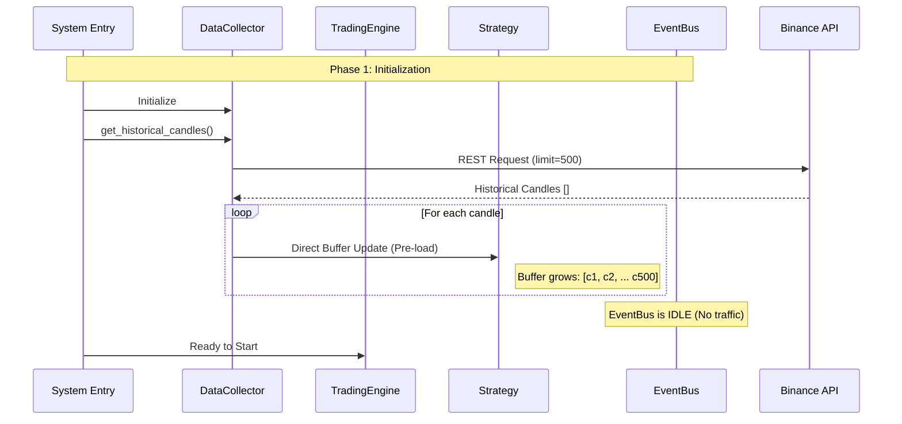
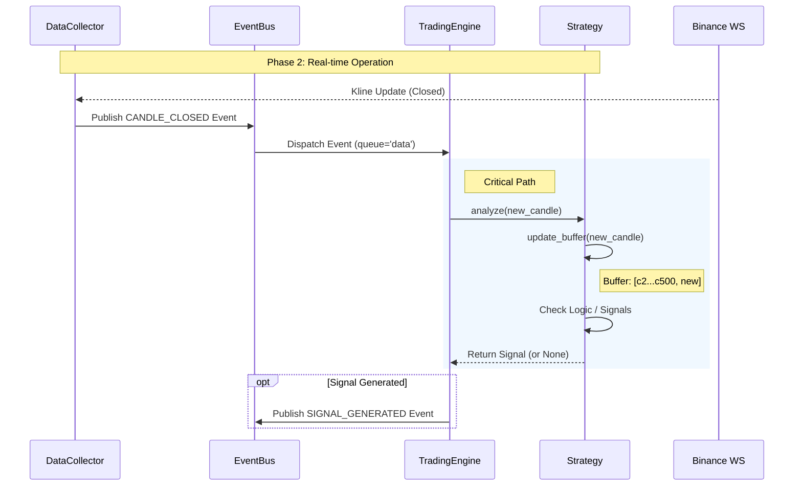

# Review: Data Flow Architecture (Historical vs. Real-time)

**Date:** 2025-12-16
**Context:** Clarification of data flow mechanisms for Data Collector, Event Bus, and Strategy.

## 1. Executive Summary

This document clarifies the architectural distinction between **Historical Data (Initialization)** and **Real-time Data (Streaming)**. The key design principle is that historical data is used for **state initialization** and does not pass through the event bus system to avoid processing overhead and false signals.

| Feature | Historical Data | Real-time Data |
| :--- | :--- | :--- |
| **Purpose** | State Initialization (Pre-load) | Event Processing (Trading) |
| **Source** | REST API | WebSocket Stream |
| **Transport** | Direct Injection (Method Call) | Event Bus (Queue) |
| **Target** | `Strategy.candle_buffer` | `Strategy.analyze()` |
| **Latency** | N/A (Batch) | Critical (Low Latency) |

---

## 2. Detailed Data Flow

### 2.1 Phase 1: System Initialization (Startup)

During the startup phase, the system builds the necessary context for the strategy to function immediately upon receiving the first real-time candle.

**Flow:**
1.  **Fetch**: `DataCollector` requests the last $N$ candles (e.g., 500) via Binance REST API.
2.  **Inject**: The system (via `TradingEngine`) calls `strategy.update_buffer()` directly for each historical candle.
3.  **State Ready**: The strategy's internal buffer is populated, and indicators are pre-calculated (if applicable).
4.  **No Events**: No `CANDLE_CLOSED` events are emitted to the EventBus.

### 2.2 Phase 2: Real-time Operation (Runtime)

Once initialized, the system switches to event-driven mode.

**Flow:**
1.  **Stream**: `DataCollector` receives a closed candle via WebSocket.
2.  **Publish**: `DataCollector` creates a `CANDLE_CLOSED` event and pushes it to the EventBus `data` queue.
3.  **Dispatch**: `TradingEngine` consumes the event.
4.  **Analyze**: `TradingEngine` calls `strategy.analyze(candle)`.
5.  **Process**:
    *   Strategy adds the new candle to the buffer (FIFO: removing the oldest).
    *   Strategy calculates logic/indicators.
    *   Strategy returns a `Signal` if conditions are met.

## 3. Implementation Notes

-   **Performance**: Bypassing the EventBus for historical data prevents "thundering herd" issues where the message queue is flooded with 1000s of events at startup.
-   **Safety**: Prevents the strategy from generating "stale" signals based on old market conditions during startup.
-   **Consistency**: The `Strategy` class treats the buffer simply as a state container, agnostic of whether the data came from REST or WebSocket, ensuring logic consistency.
