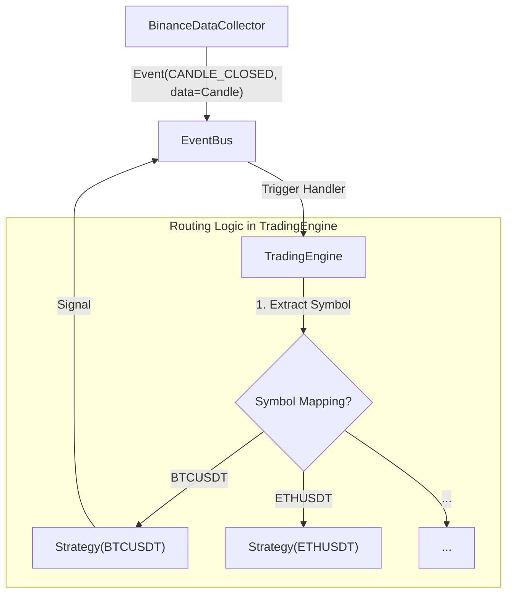

# Multi-Ticker Strategy Routing Architecture

이 계획은 단일 심볼만 처리할 수 있는 현재의 `TradingEngine`을 확장하여, 여러 심볼의 캔들 데이터를 각각의 전략 인스턴스로 라우팅하는 구조를 제안합니다.

## 제안된 변경 사항

### 구체적인 아키텍처 개요 (Routing Pattern)

현재의 `self.strategy` (단일 객체) 구조를 `self.strategies` (심볼별 매핑) 구조로 전환합니다.

### [core] [TradingEngine](file:///Users/osangwon/github/ict_2025/src/core/trading_engine.py)

#### [MODIFY] `self.strategies: Dict[str, BaseStrategy]`
- `self.strategy: Optional[Any]` 필드를 제거하거나 유지하되, 주된 처리는 `dict` 형태의 전략 관리자로 이양합니다.

#### [NEW] `add_strategy(self, strategy: BaseStrategy)`
- 외부에서 생성된 전략 인스턴스를 엔진에 등록합니다. 
- 이때 `strategy.symbol`을 키로 사용하여 `self.strategies`에 저장합니다.

#### [MODIFY] `_on_candle_closed(self, event: Event)`
- **기존**: `await self.strategy.analyze(candle)` 호출.
- **변경**: 
    1. `candle.symbol` 추출.
    2. `self.strategies.get(symbol)`로 전용 전략 인스턴스 탐색.
    3. 해당 인스턴스가 존재할 경우에만 `analyze(candle)` 실행.

## 리팩토링 정밀 분석

### 1. 난이도: **낮음 ~ 중간 (Low to Medium)**
- **정적 구조 변경**: `list`나 `dict`를 사용하는 기본적인 데이터 구조 변경 수준입니다.
- **이벤트 시스템 활용**: 이미 `Candle` 모델에 `symbol`이 포함되어 있고, `EventBus`가 비동기로 동작하고 있어 비즈니스 로직의 파괴적 변경(Breaking Change) 없이 "라우팅 계층"만 추가하면 됩니다.
- **주의 사항**: 여러 전략이 동시에 시그널을 발생시킬 때 `OrderManager`의 동시성 처리나 계좌 잔고(Margin) 공유 문제를 고려해야 합니다.

### 2. 성공 확률: **95% 이상**
- **이유**: 현재 아키텍처는 이미 객체지향적이고 이벤트 기반으로 잘 분리되어 있습니다. `TradingEngine`이 전략의 내부 로직을 모르고 `analyze()` 인터페이스만 호출하는 구조이기 때문에, 호출 대상이 1개에서 N개로 늘어나는 것은 매우 안정적으로 구현 가능합니다.

## 검증 계획

### 자동화 테스트
- `MockStrategy` 인스턴스 2개(BTC, ETH)를 생성하여 `TradingEngine`에 등록.
- `DataCollector`가 두 심볼의 캔들을 섞어서 보냈을 때, 각각의 전략 버퍼가 오염되지 않고 자신의 데이터만 처리하는지 확인.

### 수동 검증
- 로그를 통해 `[TradingEngine] Routing BTCUSDT candle to Strategy(BTCUSDT)` 와 같은 흐름이 정상적으로 발생하는지 모니터링.
