# ICT 2025 Trading System - Architecture & Flow Visualization

> 이 문서는 Obsidian에서 렌더링되는 Mermaid 다이어그램을 포함하고 있습니다.

---

## 1. 전체 시스템 아키텍처 (Main System Architecture)

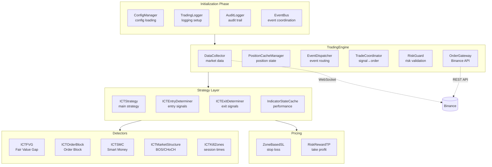

---

## 2. 런타임 데이터 흐름 (Runtime Data Flow)

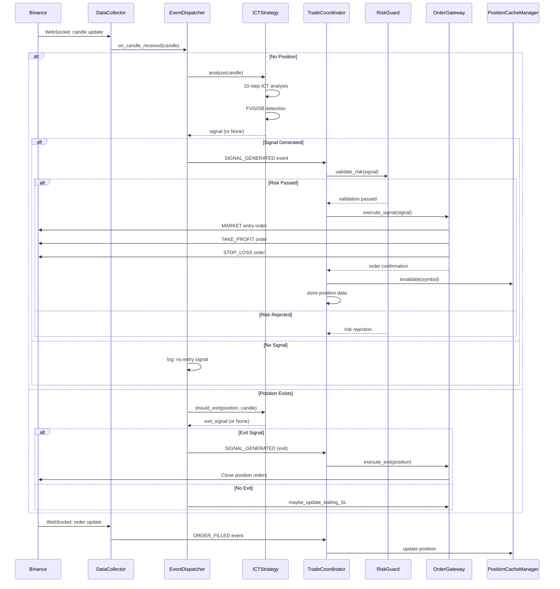

---

## 3. 시작 시퀀스 (Startup Sequence)

```mermaid
flowchart TB
    A[main.py<br/>main()] --> B[TradingBot.__init__]
    B --> C[TradingBot.initialize]
    
    C --> C1[ConfigManager.load]
    C1 --> C2[TradingLogger setup]
    C2 --> C3[AuditLogger init]
    C3 --> C4[EventBus create]
    C4 --> C5[TradingEngine create]
    
    C5 --> C6[TradingEngine.initialize_components]
    C6 --> C7[OrderGateway create]
    C7 --> C8[RiskGuard create]
    C8 --> C9[Strategy create]
    C9 --> C10[DataCollector create]
    C10 --> C11[EventDispatcher create]
    C11 --> C12[TradeCoordinator create]
    C12 --> C13[PositionCacheManager create]
    
    C13 --> D[TradingBot.backfill]
    D --> E[TradingBot.run]
    
    E --> E1[EventBus.start]
    E1 --> E2[DataCollector.start_streaming]
    E2 --> E3[start_listen_key_service]
    
    style A fill:#90EE90
    style E fill:#90EE90
```

---

## 4. 이벤트 핸들러 흐름 (Event Handler Flow)

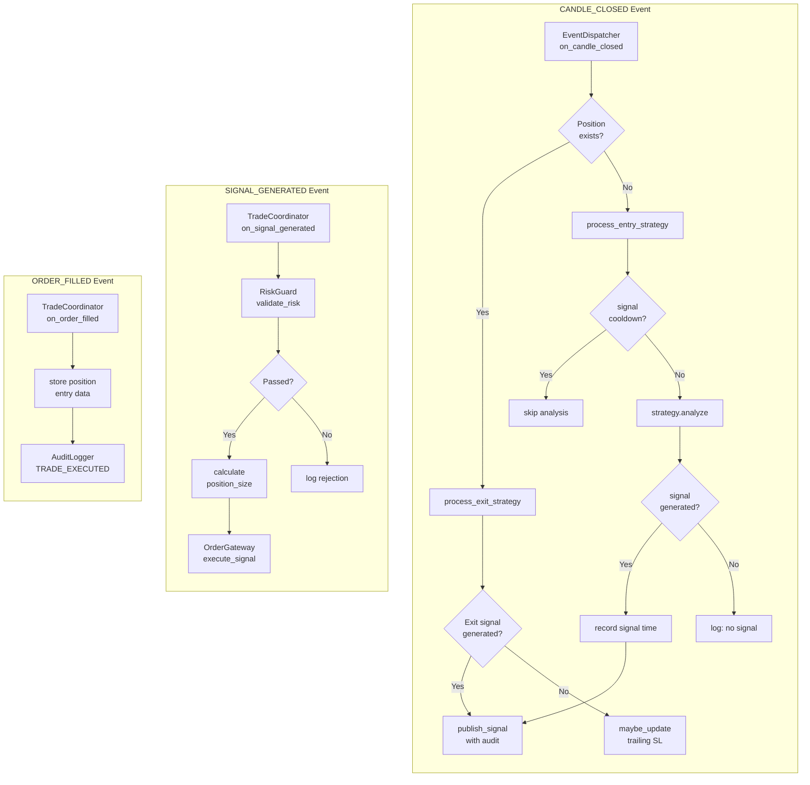

---

## 5. 주요 컴포넌트 상세 (Key Components Detail)

### 5.1 TradingBot (main.py)

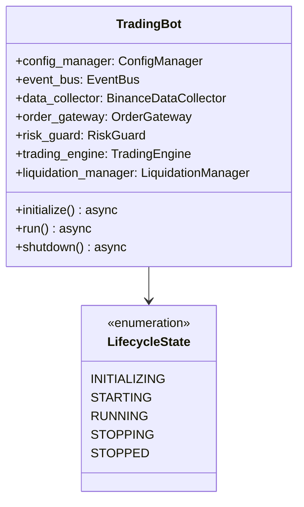

**주요 메서드:**
| 메서드 | 역할 |
|--------|------|
| `initialize()` | 컴포넌트 초기화 위임 |
| `run()` | TradingEngine 실행 |
| `shutdown()` | 정상 종료 + 긴급 청산 |

---

### 5.2 TradingEngine (trading_engine.py)

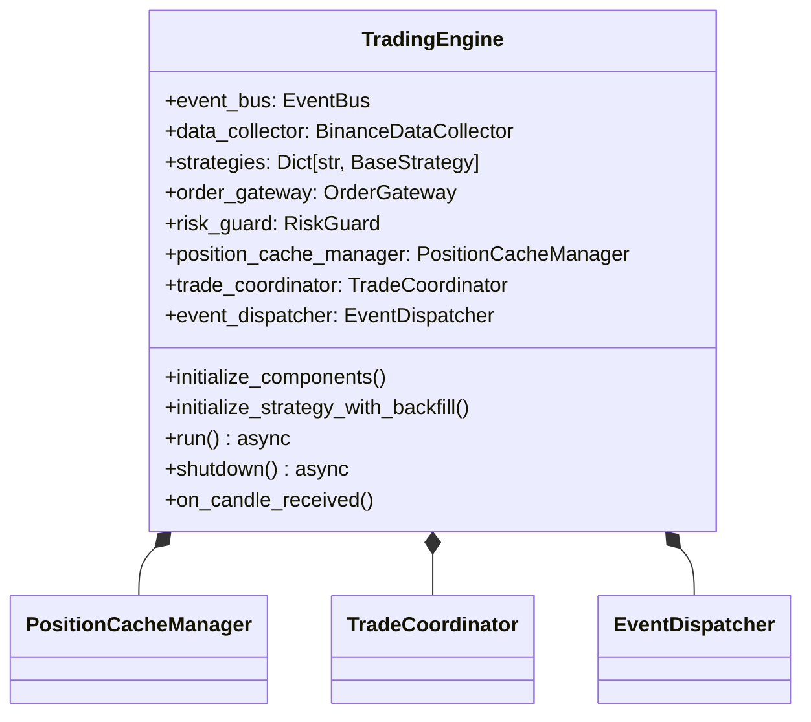

**주요 메서드:**
| 메서드 | 역할 |
|--------|------|
| `initialize_components()` | 모든 컴포넌트 생성 및 연결 |
| `initialize_strategy_with_backfill()` |_historical data로 전략 초기화 |
| `run()` | WebSocket 스트리밍 시작 |
| `on_candle_received()` | 데이터 콜백 → EventDispatcher 위임 |

---

### 5.3 EventDispatcher (event_dispatcher.py)

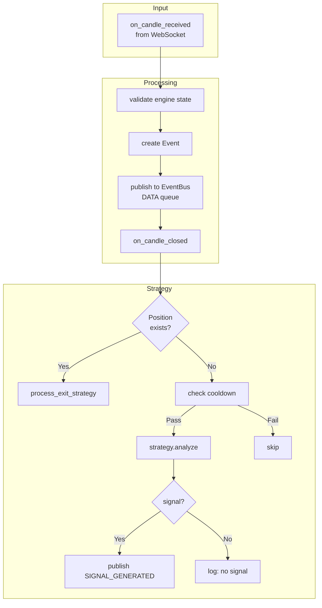

**주요 메서드:**
| 메서드 | 역할 |
|--------|------|
| `on_candle_received()` | WebSocket 콜백 → EventBus 연동 |
| `on_candle_closed()` | 캔들 마감 시 전략 분석 |
| `process_entry_strategy()` | 진입 신호 생성 |
| `process_exit_strategy()` | 청산 신호 생성 |
| `publish_signal_with_audit()` | 신호 발행 + 감사 로깅 |

---

### 5.4 TradeCoordinator (trade_coordinator.py)

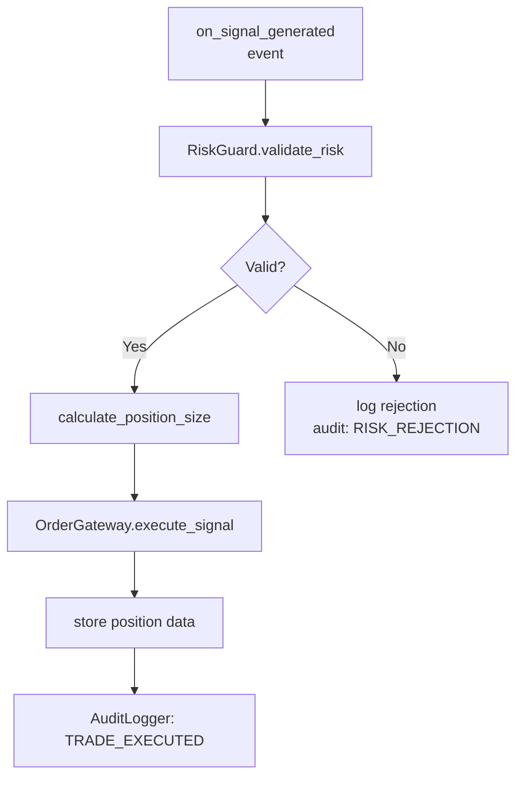

**주요 메서드:**
| 메서드 | 역할 |
|--------|------|
| `on_signal_generated()` | 신호 수신 → 위험 검증 |
| `on_order_filled()` | 주문 체결 추적 |
| `on_order_partially_filled()` | 부분 체결 처리 |

---

### 5.5 ICTStrategy (ict_strategy.py)

```mermaid
flowchart TB
    A[analyze(candle)] --> B[10-Step ICT Analysis]
    
    B --> B1[KillZone check]
    B1 --> B2[Trend analysis]
    B2 --> B3[Premium/Discount]
    B3 --> B4[FVG detection]
    B4 --> B5[Order Block detection]
    B5 --> B6[Liquidity analysis]
    B6 --> B7[Inducement check]
    B7 --> B8[Displacement]
    B8 --> B9[Entry timing]
    B9 --> B10[TP/SL calculation]
    B10 --> R{Signal?}
    R -->|Yes| S[return Signal]
    R -->|No| N[return None]
```

**10-Step ICT Analysis:**
1. **Kill Zone Filter** - London/NY 세션 확인
2. **Trend Analysis** - 시장 구조 분석 (BOS/CHoCH)
3. **Premium/Discount** - 가치 구역 판단
4. **FVG Detection** - Fair Value Gap 탐지
5. **Order Block** - 기관 주문 구역 탐지
6. **Liquidity** - 유동성 레벨 분석
7. **Inducement** - 유인 거래 확인
8. **Displacement** - 강세 이동 확인
9. **Entry Timing** - 진입 타이밍
10. **TP/SL Calculation** - 익절/손절 계산

---

## 6. Detector 컴포넌트 (Detector Components)

```mermaid
flowchart TB
    subgraph Detectors
        D1[ICTFVG<br/>Fair Value Gap]
        D2[ICTOrderBlock<br/>Order Block]
        D3[ICTSMC<br/>Smart Money Concepts]
        D4[ICTMarketStructure<br/>Market Structure]
        D5[ICTKillZones<br/>Trading Sessions]
    end
    
    D1 --> D1A[detect_bullish_fvg]
    D1 --> D1B[detect_bearish_fvg]
    D1 --> D1C[find_nearest_fvg]
    D1 --> D1D[update_fvg_status]
    
    D2 --> D2A[identify_bullish_ob]
    D2 --> D2B[identify_bearish_ob]
    D2 --> D2C[validate_ob_strength]
    
    D3 --> D3A[detect_inducement]
    D3 --> D3B[detect_displacement]
    D3 --> D3C[find_mitigation_zone]
    
    D4 --> D4A[identify_swing_highs]
    D4 --> D4B[identify_swing_lows]
    D4 --> D4C[detect_bos]
    D4 --> D4D[detect_choch]
```

**Detector 결과 모델 (indicators.py):**
| Model | Attributes |
|-------|------------|
| `FairValueGap` | gap_high, gap_low, status, fill_percent |
| `OrderBlock` | high, low, direction, strength, status |
| `SwingPoint` | price, type, strength |
| `StructureBreak` | type, direction, broken_level |

---

## 7. OrderGateway (order_gateway.py)

```mermaid
flowchart TB
    E[execute_signal(signal)] --> V[validate order params]
    V --> M[place MARKET order]
    M --> T[place TAKE_PROFIT order]
    T --> S[place STOP_LOSS order]
    
    M --> MA[update position cache]
    T --> TA[track TP order]
    S --> SA[track SL order]
    
    style M fill:#FFE4B5
    style T fill:#FFE4B5
    style S fill:#FFE4B5
```

**주요 메서드:**
| 메서드 | 역할 |
|--------|------|
| `execute_signal()` | 진입 주문 + TP/SL 동시下单 |
| `execute_exit()` | 포지션 청산 |
| `update_stop_loss()` | Trailing SL 동적 업데이트 |
| `cancel_order()` | 주문 취소 |
| `get_open_orders()` | 미체결 주문 조회 |

---

## 8. PositionCacheManager (position_cache_manager.py)

```mermaid
flowchart TB
    G[get(symbol)] --> C{Cache valid?}
    C -->|Yes| R[return cached]
    C -->|No| F[get_fresh from API]
    F --> U[update cache]
    U --> R
    
    W[WebSocket update] --> P[update_from_websocket]
    P --> V[validate update]
    V --> C
    
    style C fill:#E6E6FA
    style W fill:#E6E6FA
```

**주요 메서드:**
| 메서드 | 역할 |
|--------|------|
| `get()` | 캐시된 포지션 조회 (TTL: 60s) |
| `get_fresh()` | API에서 최신 포지션 조회 |
| `invalidate()` | 캐시 무효화 |
| `update_from_websocket()` | WebSocket으로 실시간 동기화 |

---

## 9. RiskGuard (risk_guard.py)

```mermaid
flowchart TB
    S[validate_risk(signal)] --> M{max positions?}
    M -->|Pass| W[whitelist symbol?]
    M -->|Fail| RJ[reject: max positions]
    
    W -->|Pass| D[price deviation?]
    W -->|Fail| RJ2[reject: not whitelisted]
    
    D -->|Pass| DW[drawdown check]
    D -->|Fail| RJ3[reject: price deviation]
    
    DW -->|Pass| V[validation passed]
    DW -->|Fail| RJ4[reject: drawdown]
    
    V --> SZ[calculate_position_size]
```

**파라미터:**
| Parameter | Default | Description |
|-----------|---------|-------------|
| `max_positions` | 3 | 최대 동시 포지션 |
| `max_position_size_percent` | 10% | 계정당 최대 포지션 크기 |
| `max_risk_per_trade` | 1% | 거래당 최대 리스크 |
| `max_daily_loss_pct` | 5% | 일일 손실 한도 |

---

## 10. 종료 시퀀스 (Shutdown Sequence)

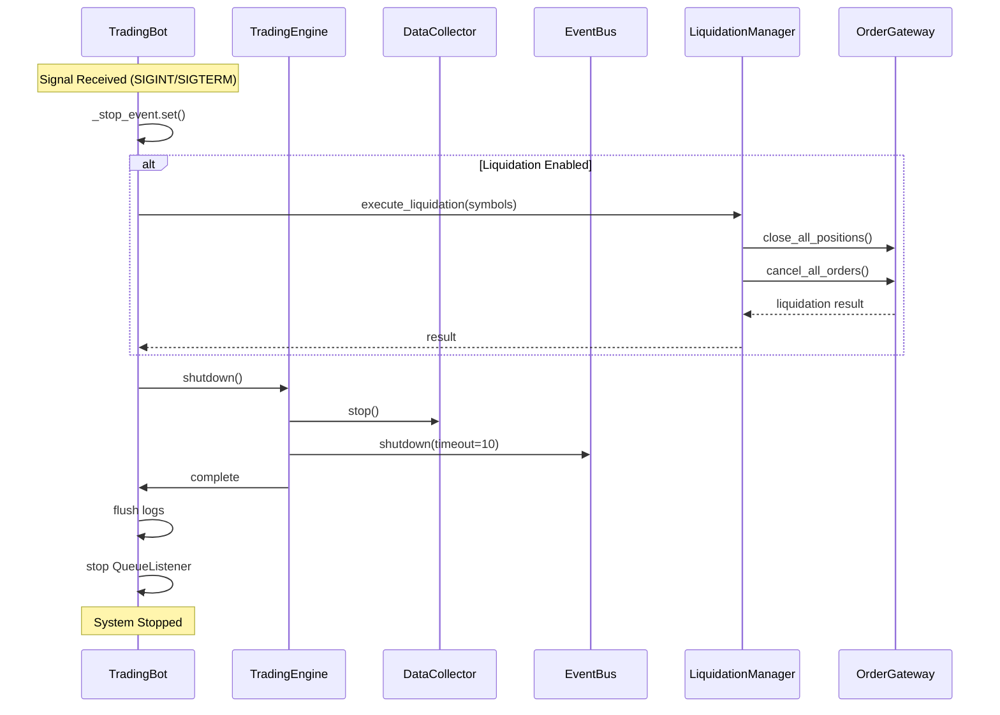

---

## 11. 데이터 모델 (Data Models)

### Candle
```python
@dataclass(slots=True)
class Candle:
    symbol: str
    interval: str
    open: float
    high: float
    low: float
    close: float
    volume: float
    timestamp: int
    is_closed: bool
```

### Signal
```python
@dataclass
class Signal:
    signal_type: SignalType          # ENTRY or EXIT
    symbol: str
    side: OrderSide                  # BUY or SELL
    entry_price: float
    stop_loss: float
    take_profit: float
    quantity: float
    strategy_name: str
    risk_reward_ratio: float
    is_exit_signal: bool = False
    exit_reason: Optional[str] = None
```

### Position
```python
@dataclass
class Position:
    symbol: str
    side: str                         # "LONG" or "SHORT"
    quantity: float
    entry_price: float
    current_price: float
    unrealized_pnl: float
    timestamp: int
```

---

## 12. 이벤트 타입 (Event Types)

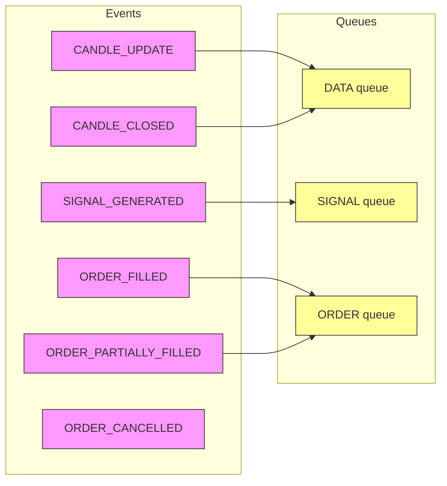

| Event Type | Queue | Handler |
|------------|-------|---------|
| `CANDLE_UPDATE` | DATA | (logging only) |
| `CANDLE_CLOSED` | DATA | EventDispatcher.on_candle_closed |
| `SIGNAL_GENERATED` | SIGNAL | TradeCoordinator.on_signal_generated |
| `ORDER_FILLED` | ORDER | TradeCoordinator.on_order_filled |
| `ORDER_PARTIALLY_FILLED` | ORDER | TradeCoordinator.on_order_partially_filled |

---

## 13. 설정 파라미터 (Configuration)

### trading_config.ini
```ini
[trading]
symbols = BTCUSDT, ETHUSDT
intervals = 1h,4h
strategy = ict_strategy
leverage = 10
margin_type = ISOLATED
max_risk_per_trade = 0.01
take_profit_ratio = 2.0

[ict]
use_killzones = true
fvg_min_gap_percent = 0.1
ob_displacement_ratio = 1.5
```

---

## 14. 파일 구조 요약 (File Structure Summary)

```
src/
├── main.py                          # TradingBot (Orchestrator)
├── core/
│   ├── trading_engine.py            # TradingEngine (Component orchestration)
│   ├── event_bus.py                 # Event pub-sub with priority queues
│   ├── event_dispatcher.py          # Candle → Strategy routing
│   ├── data_collector.py            # Data facade
│   ├── public_market_streamer.py    # WebSocket market data
│   ├── private_user_streamer.py     # WebSocket user data
│   ├── position_cache_manager.py   # Position state cache
│   ├── binance_service.py           # REST API client
│   ├── circuit_breaker.py           # Failure protection
│   └── audit_logger.py              # Compliance logging
├── execution/
│   ├── order_gateway.py             # Order execution
│   ├── trade_coordinator.py        # Signal → Order coordination
│   ├── config_validator.py          # Order validation
│   └── liquidation_manager.py      # Emergency shutdown
├── strategies/
│   ├── base.py                     # BaseStrategy interface
│   ├── ict_strategy.py             # ICT main strategy
│   ├── composable.py                # Composable strategy
│   ├── module_config_builder.py     # Module configuration
│   └── indicator_cache.py           # Performance optimization
├── entry/
│   ├── base.py                     # Entry interface
│   └── ict_entry.py                # ICT entry logic
├── exit/
│   ├── base.py                     # Exit interface
│   └── ict_exit.py                 # ICT exit logic
├── detectors/
│   ├── base.py                     # Detector base
│   ├── ict_fvg.py                  # Fair Value Gap
│   ├── ict_order_block.py           # Order Block
│   ├── ict_smc.py                  # Smart Money Concepts
│   ├── ict_market_structure.py      # BOS/CHoCH
│   └── ict_killzones.py            # Trading sessions
├── pricing/
│   ├── base.py                     # PriceContext
│   ├── stop_loss/
│   │   ├── zone_based.py           # FVG/OB based SL
│   │   └── percentage.py           # Percentage SL
│   └── take_profit/
│       ├── risk_reward.py          # Risk-Reward TP
│       └── displacement.py        # Displacement TP
├── risk/
│   └── risk_guard.py               # Risk validation
├── models/
│   ├── candle.py                   # Candle model
│   ├── signal.py                   # Signal model
│   ├── position.py                 # Position model
│   ├── order.py                    # Order model
│   ├── event.py                    # Event model
│   └── indicators.py               # Indicator models
└── config/
    ├── config_manager.py            # Config loading
    ├── symbol_config.py            # Symbol settings
    └── ict_profiles.py             # ICT profiles
```

---

## 15. 핵심 흐름 요약 (Key Flow Summary)

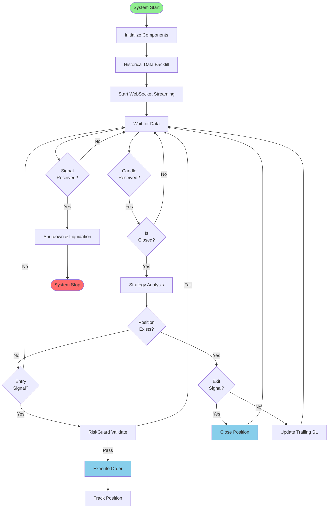
