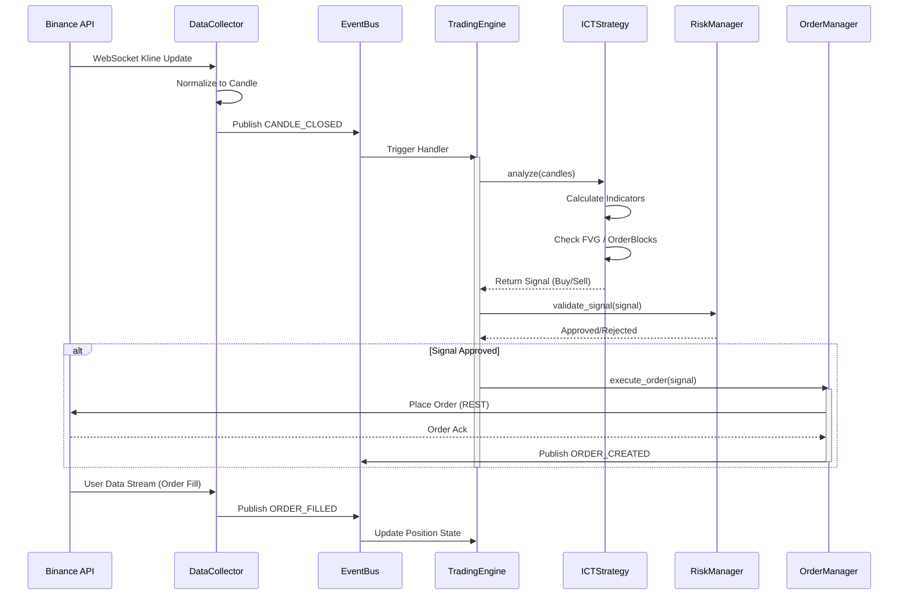
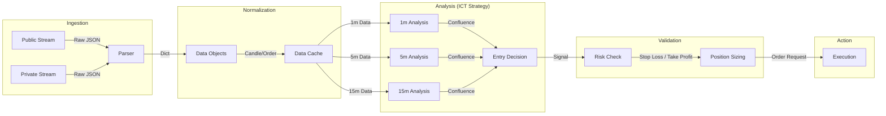

# ICT 2025 Trading System Architecture

This document outlines the architectural design of the ICT 2025 Trading System using Mermaid diagrams.

## 1. High-Level Architecture

This diagram illustrates the core components and their relationships within the system. The **EventBus** acts as the central communication hub, decoupling components.

```mermaid
graph TD
    subgraph "External"
        BinanceAPI[Binance Futures API]
    end

    subgraph "Orchestration"
        Main[TradingBot (main.py)]
    end

    subgraph "Core System"
        EB[EventBus]
        TE[TradingEngine]
    end

    subgraph "Data Layer"
        BDC[BinanceDataCollector]
        PMS[PublicMarketStreamer]
        PUS[PrivateUserStreamer]
        BSC[BinanceServiceClient]
    end

    subgraph "Strategy & Logic"
        STRAT[ICTStrategy]
        RISK[RiskManager]
        LIQ[LiquidationManager]
    end

    subgraph "Execution"
        OEM[OrderExecutionManager]
    end

    %% Wiring
    Main -->|Initializes| TE
    Main -->|Initializes| EB
    Main -->|Initializes| BDC
    
    %% Data Flow
    BinanceAPI <-->|WS/REST| PMS
    BinanceAPI <-->|WS/REST| PUS
    BinanceAPI <-->|REST| BSC
    
    PMS -->|Raw Data| BDC
    PUS -->|Raw Data| BDC
    
    BDC -->|Publishes Events| EB
    EB -->|Notifies| TE
    
    %% Logic Flow
    TE -->|Uses| STRAT
    TE -->|Uses| RISK
    TE -->|Uses| LIQ
    TE -->|Commands| OEM
    
    OEM -->|Uses| BSC
    OEM -->|Publishes Events| EB
```

## 2. Event Flow Architecture

This diagram demonstrates the event-driven nature of the system, specifically the lifecycle of a market data event leading to order execution.



## 3. Data Pipeline & Processing

This diagram focuses on how data transforms as it moves through the system, specifically highlighting the Multi-Timeframe analysis capabilities.



## 4. Deployment Architecture

This diagram shows the runtime environment and process structure of the Python application.

```mermaid
graph TB
    subgraph "Host Server / Container"
        subgraph "Python Process (Main)"
            subgraph "Asyncio Event Loop"
                Task1[Main Loop]
                Task2[WS Keepalive]
                Task3[Event Consumer]
            end
            
            subgraph "Memory"
                State[Trading State]
                Queue[Event Queue]
            end
            
            Log[Logger]
        end
        
        FileSys[(Logs / Config)]
    end
    
    subgraph "External Services"
        BN[Binance Futures Cloud]
        TG[Telegram (Optional)]
    end

    Task1 --> State
    Task3 --> State
    Task3 --> Queue
    Python Process --> FileSys
    Python Process <-->|HTTPS/WSS| BN
    Python Process -->|HTTPS| TG
```
