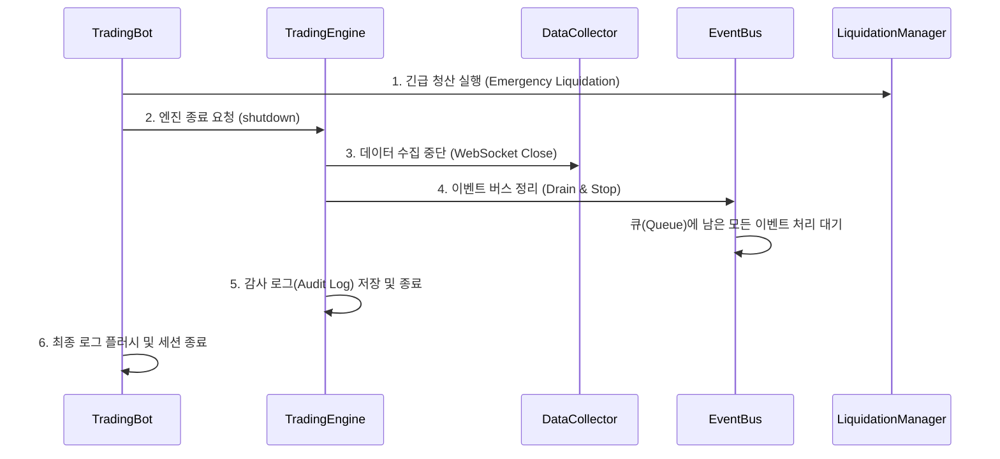

# 캔들 데이터 흐름 및 시스템 수명 주기 (Lifecycle) 분석

이 문서는 ICT 2025 트레이딩 시스템에서 캔들 데이터가 전략 버퍼에 저장되는 방식, 로깅 로직, 그리고 시스템 종료 시의 처리 과정을 상세히 설명합니다.

---

## 1. 전략 유형별 캔들 버퍼 저장 방식

전략이 캔들을 수신하고 내부 버퍼(`candle_buffer`)를 업데이트하는 방식은 상속받는 베이스 클래스에 따라 달라집니다.

### 1.1 BaseStrategy 직접 상속 (예: ICTStrategy)
* **구조**: 단일 `deque` 버퍼(`self.candle_buffer`)를 가집니다.
* **동작**: `TradingEngine`에서 전달되는 모든 캔들을 `candle.interval`에 관계없이 하나의 버퍼에 순차적으로 추가합니다.
* **특징**: `trading_config.intervals`에 여러 간격(예: `['1m', '5m']`)이 설정된 경우, 단일 버퍼 내에 서로 다른 시간 프레임의 캔들이 뒤섞이게 됩니다. 이는 특정 시간 프레임의 데이터만을 필요로 하는 지표 계산 시 주의가 필요합니다.

### 1.2 MultiTimeframeStrategy 상속
* **구조**: 내부적으로 각 간격별로 별도의 버퍼(Dictionary of deques)를 관리하도록 설계되었습니다.
* **동작**: 백필(Backfill) 시 엔진은 각 간격별로 `initialize_with_historical_data(interval, candles)`를 호출하여 독립된 버퍼를 초기화합니다.
* **특징**: 실시간 캔들 수신 시 `candle.interval`을 식별하여 해당되는 간격의 버퍼만 업데이트하므로, 다중 시간 프레임 분석에 적합합니다.

---

## 2. 캔들 데이터 로깅 및 EventBus 발행

`TradingEngine`은 수신된 캔들을 처리하고 EventBus에 발행할 때 다음과 같은 로깅 로직을 수행합니다.

### 2.1 로그 형식 분석: `→ EventBus`
```python
self.logger.info(f"📊 Candle closed: {candle.symbol} {candle.interval} @ {candle.close} → EventBus")
```
* **의미**: 해당 캔들이 **마감(Closed)**되었으며, `CANDLE_CLOSED` 이벤트 타입으로 EventBus의 `data` 큐에 정상적으로 발행되었음을 의미합니다.
* **마감 캔들**: `candle.is_closed`가 `True`인 경우이며, 전략의 `analyze()` 메서드를 트리거하는 핵심 데이터입니다.

### 2.2 미마감(Live) 캔들의 처리
* **발행 여부**: 마감되지 않은 실시간 업데이트 캔들도 **항상 EventBus에 발행됩니다.**
* **이벤트 타입**: `EventType.CANDLE_UPDATE`로 발행됩니다.
* **로깅 방식**: 실전 트레이딩 시 로그 폭증을 방지하기 위해, 매 분의 첫 5초 이내의 업데이트만 `🔄 Live data: ...` 형태로 요약 출력(Heartbeat)합니다.

---

## 3. 시스템 실행 및 종료 시퀀스 (Lifecycle)

사용자 인터럽트(Ctrl+C) 또는 시스템 종료 시, 데이터 손실과 미결제 주문 방지를 위해 정교한 종료 과정을 거칩니다.

### 3.1 실행 및 제어 흐름
1.  **`main()`**: `bot.run()`을 호출하며, 이는 비동기 루프가 완전히 종료될 때까지 블로킹됩니다.
2.  **`TradingBot.run()`**: `TradingEngine.run()`을 실행하며, 종료 시 `finally` 절에서 `bot.shutdown()`을 호출합니다.
3.  **`TradingEngine.run()`**: `EventBus`와 `DataCollector` 등의 백그라운드 태스크를 `asyncio.gather`로 실행하며 유지합니다.

### 3.2 종료 시퀀스 (Shutdown Sequence)
종료 요청이 발생하면 다음과 같은 역순으로 컴포넌트가 정리됩니다.



### 3.3 주요 Q&A
* **`main()`의 `finally` 절 시점**: `bot.run()`이 반환된 직후, 즉 모든 비동기 태스크와 봇/엔진의 `shutdown()` 절차가 완료된 후에 실행됩니다. 최종 세션 요약 로그를 남기는 용도입니다.
* **백그라운드 실행 처리**: `TradingEngine.run()`은 내부적으로 `EventBus` 등의 루프가 살아있는 동안 계속 블로킹 상태를 유지합니다. 종료 신호가 오면 이 루프들을 `cancel` 하거나 `stop` 시켜서 안전하게 빠져나옵니다.
* **이벤트 유실 방지**: `EventBus.shutdown()`은 단순히 중단하는 것이 아니라, 큐에 쌓인 데이터(특히 주문 관련)가 모두 처리될 때까지 최대 10초간 대기(Drain)하는 과정을 포함합니다.
